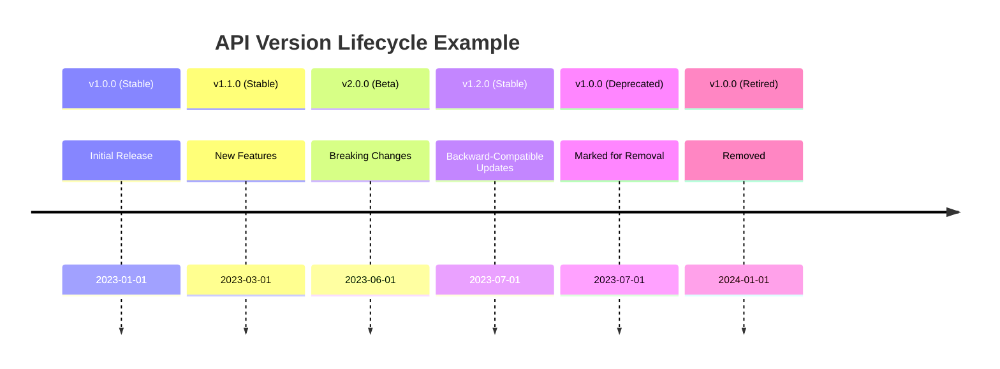

# API Versioning Strategy

This document outlines the versioning strategy for the Cognitive Mesh API to ensure backward compatibility and smooth transitions between versions.

## Versioning Scheme

We follow [Semantic Versioning (SemVer) 2.0.0](https://semver.org/) for our API:

- **MAJOR** version (X.0.0): Incompatible API changes
- **MINOR** version (0.X.0): Add functionality in a backward-compatible manner
- **PATCH** version (0.0.X): Backward-compatible bug fixes

## Version Inclusion in Requests

API versions are included in the URL path:

```
https://api.cognitivemesh.com/v1/resource
```

## Version Lifecycle

| Stage         | Description                                                                 | Duration          |
|---------------|-----------------------------------------------------------------------------|-------------------|
| **Alpha**     | Initial development, breaking changes allowed                               | 1-2 months        |
| **Beta**      | Feature complete, no breaking changes, minor version bump                   | 1-3 months        |
| **Stable**    | Production-ready, follows semantic versioning                               | 12+ months        |
| **Deprecated**| Announcement of upcoming removal, maintain for at least 6 months           | 6-12 months       |
| **Retired**   | No longer supported, returns 410 Gone                                       | N/A               |

## Deprecation Policy

1. **Announcement**: Deprecated endpoints will be announced in the changelog and via API headers.
2. **Timeline**: Minimum 6 months from deprecation to removal.
3. **Documentation**: Clear documentation of alternatives and migration paths.
4. **Headers**: Deprecated endpoints include:
   ```
   Deprecation: true
   Sunset: Wed, 01 Jan 2025 00:00:00 GMT
   Link: </v2/new-endpoint>; rel="successor-version"
   ```

## Breaking Changes

Breaking changes require a MAJOR version bump and include:

- Removing or renaming endpoints
- Changing request/response schemas
- Modifying authentication or authorization requirements
- Changing error response formats

## Non-Breaking Changes

These changes are allowed in MINOR and PATCH versions:

- Adding new endpoints
- Adding optional request parameters
- Adding new properties to responses
- Adding new enum values
- Adding new error codes
- Improving error messages

## Version Negotiation

Clients can specify the API version using:

1. **URL Path**: Preferred method
   ```
   GET /v1/resource
   ```

2. **Accept Header**: Alternative method
   ```
   Accept: application/vnd.cognitivemesh.v1+json
   ```

## Version Selection Algorithm

1. Use the version in the URL path if specified
2. Fall back to the Accept header if no version in path
3. Default to the latest stable version if no version specified

## Example Versioning Scenario



## Best Practices

1. **Client Applications**:
   - Always specify the exact API version in requests
   - Handle deprecation warnings in responses
   - Plan for version upgrades during maintenance windows

2. **API Development**:
   - Maintain thorough changelog
   - Provide migration guides between major versions
   - Use feature flags for experimental features
   - Monitor usage of deprecated endpoints

3. **Documentation**:
   - Clearly mark deprecated endpoints
   - Include version compatibility information
   - Provide code examples for all versions

## Version Endpoints

### List Available Versions

```http
GET /versions
```

Response:
```json
{
  "versions": [
    {
      "version": "2.0.0",
      "status": "stable",
      "release_date": "2023-06-01",
      "end_of_life": "2024-12-31"
    },
    {
      "version": "1.2.0",
      "status": "deprecated",
      "release_date": "2023-03-15",
      "end_of_life": "2023-12-31"
    }
  ],
  "latest": "2.0.0",
  "current": "2.0.0"
}
```

### Check Version Health

```http
GET /health/v1
```

Response:
```json
{
  "status": "healthy",
  "version": "1.0.0",
  "timestamp": "2023-07-01T12:00:00Z",
  "endpoints": [
    {
      "path": "/resource",
      "status": "operational"
    },
    {
      "path": "/deprecated/resource",
      "status": "deprecated",
      "replacement": "/v2/new-resource"
    }
  ]
}
```

## Migration Between Versions

When migrating between major versions:

1. Review the changelog for breaking changes
2. Test your application with the new version in a staging environment
3. Update your code to handle any deprecated features
4. Monitor your application after the update

## Support Policy

- **Active Support**: Latest stable version and previous minor version
- **Security Fixes**: All versions released in the last 12 months
- **Bug Fixes**: Latest patch version of each minor release

## Deprecation Notices

Deprecation notices will be:

1. Announced in the changelog
2. Included in API responses via headers
3. Emailed to registered developers
4. Posted to the developer portal

## Contact

For questions about API versioning, contact [support@cognitivemesh.com](mailto:support@cognitivemesh.com)
