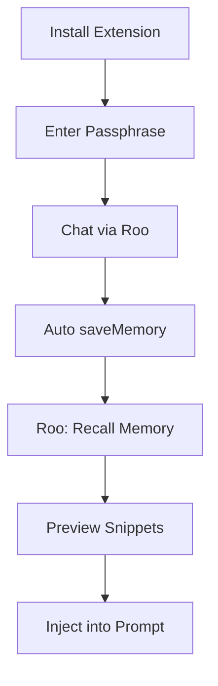

---

## Module: MemoryAgent Primary Personas: Software Developers, Privacy‑Focused IT Leads, QA Testers Core Value Proposition: Seamless, private, on‑device chat memory within IDEs—zero data leaves the workstation. Priority: P2 License Tier: Community (core) / Enterprise (advanced Claude integration) Platform Layers: Foundation, Reasoning, Metacognitive, Agency, Business Apps Main Integration Points: Local Encrypted Memory Store, Claude Desktop Memory API, Widget Registry

# Product Requirements Document: MemoryAgent MCP PRD

**Product:** MemoryAgent MCP PRD\
**Author:** J\
**Date:** 2025‑07‑04

---

## 1. Overview

**MemoryAgent** integrates the Cognitive Mesh Provider (MCP) with desktop IDEs (VS Code, Cursor) to capture, encrypt, and recall chat context *locally*.  By combining a lightweight SQLite + FAISS store with optional Claude Desktop Memory semantic recall, developers keep intellectual property private while benefiting from persistent AI memory.  All operations stay on‑device, audited, and RBAC‑enforced.

---

## 2. Goals

### Business Goals

| Goal                                    | KPI                                                 |
| --------------------------------------- | --------------------------------------------------- |
| Reduce developer prompt repetition      | ≥ 40 % fewer repeated questions in 30‑day telemetry |
| Drive adoption of MCP developer tooling | ≥ 5 DAU within first sprint                         |
| Maintain zero cloud cost increase       | 0 \$ additional Azure spend                         |

### User Goals

- Retrieve relevant past chats in <200 ms (P95) without leaving IDE.
- Tag or omit sensitive content with one click.
- View, edit, or purge memory entries from an integrated web‑view.

### Non‑Goals

- Not intended to sync memory across devices (future roadmap).
- Not a full‑document RAG system.

---

## 3. Stakeholders

- **Product Owner:** J
- **Engineering Lead:** Developer Experience Team
- **Security:** Zero‑Trust Council
- **End Users:** Devs, QA, IT Privacy Officers

---

## 4. User Stories

| Persona   | Story                                                                                                 |
| --------- | ----------------------------------------------------------------------------------------------------- |
| Developer | *As a developer I want my AI chats remembered across sessions so I can avoid re‑explaining problems.* |
| Developer | *I want to mark parts of a chat as private so the model never sees them again.*                       |
| IT Lead   | *I need proof that no data leaves the device to satisfy compliance.*                                  |
| QA        | *I need to verify recall precision ≥90 % to approve production rollout.*                              |

---

## 5. Functional Requirements

| ID      | Requirement                                                                    | Phase | Priority |
| ------- | ------------------------------------------------------------------------------ | ----- | -------- |
| FR1     | `saveMemory(sessionId,messages)` persists encrypted chat batch in SQLite (WAL) | 1     | P0       |
| FR2     | `queryMemory(sessionId,query,topK)` returns semantic snippets via FAISS cosine | 1     | P0       |
| FR3     | VS Code command **Roo: Recall Memory** injects top‑K into prompt               | 1     | P1       |
| FR4     | Optional Claude Desktop Memory API integration for richer embedding            | 2     | P1       |
| FR5     | Tagging (`private`/`public`/custom) and tag‑filtered recall                    | 2     | P2       |
| FR6     | Web‑view Management UI (list, edit, delete, backup)                            | 3     | P2       |
| FR7     | AES‑256 at‑rest encryption with passphrase flow                                | 1     | P0       |
| FR‑Gov1 | Emit `MemoryLog` events to local encrypted audit log                           | 1‑3   | P0       |

---

## 6. Non‑Functional Requirements

| ID   | Category        | Requirement                                | Target            |
| ---- | --------------- | ------------------------------------------ | ----------------- |
| NFR1 | Performance     | Recall latency                             | P95 < 200 ms      |
| NFR2 | Reliability     | Local service uptime                       | ≥ 99.5 %          |
| NFR3 | Security        | 100 % AES‑256 encrypted at rest; no egress | Verified by audit |
| NFR4 | Maintainability | Unit test coverage                         | ≥ 80 %            |

---

## 7. UX Flow



- **Tagging:** Right‑click chat → *Mark Private* or `/tag private` command.
- **Management UI:** Web‑view lists entries, allows bulk delete, export, backup.

---

## 8. Technical Architecture & Integrations

```
┌────────────┐  saveMemory/query  ┌───────────┐  cosine search ┌──────────────┐
│ Roo Client │ ─────────────────► │  MemoryDB │ ───────────────►│  FAISS Index │
└────────────┘                   └───────────┘◄───────────────┘
        ▲                                   ▲
        │ ClaudeEmb API (opt)               │ auditLog
┌──────────────┐                            │
│ ClaudeMemory │◄───────────────────────────┘
└──────────────┘
```

- **Ports (Foundation):** `IMemoryStorePort`, `IAuditLogPort`
- **Adapters:** SQLite adapter, FAISS adapter, Claude API adapter (opt)
- **Encryption:** SQLCipher for SQLite; key derived via PBKDF2 from passphrase.

---

## 9. Mesh Layer Mapping

| Layer         | Component                                  | Port / Responsibility                          |
| ------------- | ------------------------------------------ | ---------------------------------------------- |
| Foundation    | EncryptedSQLiteStore, AuditLogger          | Implements `IMemoryStorePort`, `IAuditLogPort` |
| Reasoning     | RecallEngine, TagFilter                    | Semantic search, ranking, tag enforcement      |
| Metacognitive | PrivacyMonitor, LatencyMonitor             | Detect PII, track recall latency               |
| Agency        | MemoryWorkflowOrchestrator                 | save→query→inject orchestration                |
| Business Apps | VS Code/Cursor Extension, Memory UI Widget | User‑facing commands and UI                    |

---

## 10. Main APIs

### saveMemory

```
POST /memory/save
{ "sessionId":"uuid","messages":[{"role":"user","text":"..."}],"tags":["public"] }
```

### queryMemory

```
GET /memory/query?sessionId=uuid&query="vector db"&topK=5&includeTags=public
```

Response: `{ "snippets":[{"text":"...","score":0.88,"entryId":"e123"}] }`

---

## 11. Audit Taxonomy

| Event         | Fields                   |
| ------------- | ------------------------ |
| MemorySaved   | sessionId, entries, user |
| MemoryQueried | sessionId, query, topK   |
| MemoryTagged  | entryId, tagOld, tagNew  |
| MemoryDeleted | entryId, user            |

---

## 12. Timeline & Milestones

| Phase | Duration | Exit Criteria                                    |
| ----- | -------- | ------------------------------------------------ |
| 1     | 1 wk     | FR1–FR2 live; P95 < 200 ms; encryption verified  |
| 2     | 2 wks    | Claude integration + tagging; unit tests 80 %    |
| 3     | 1 wk     | Web‑view UI; audit log viewer; security sign‑off |

---

## 13. Success Metrics

- **Recall Precision:** ≥ 90 % developer annotation.
- **Latency:** P95 < 200 ms.
- **Adoption:** ≥ 5 DAU in pilot team.
- **Security Incidents:** 0.

---

## 14. Risks & Mitigations

| Risk                        | Mitigation                         |
| --------------------------- | ---------------------------------- |
| DB corruption               | WAL + backups                      |
| Passphrase loss             | Secure export utility              |
| Claude API drift            | Version lock + fallback mode       |
| Performance hit on large DB | LRU eviction, shard DB per project |

---

## 15. Open Questions

1. Should memory scope default to *workspace* instead of *session*?
2. Do we need per‑snippet encryption keys for selective sharing in future?
3. What’s the acceptable storage cap (MB) before eviction?

---

> **MemoryAgent:** Private, on‑device chat memory—built for developers who value speed *and* confidentiality.

